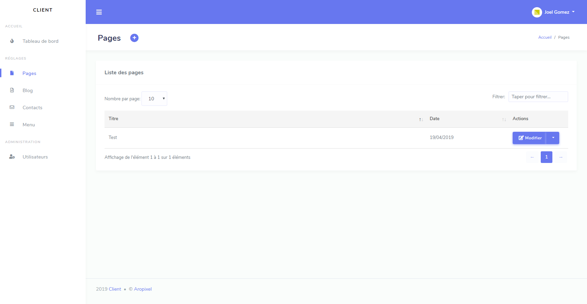
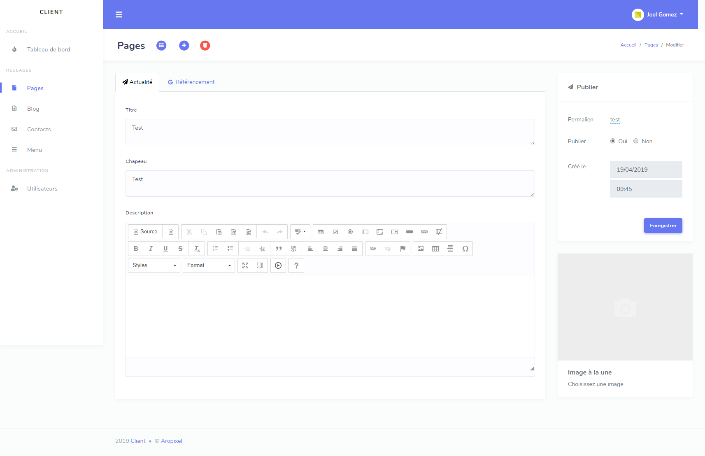

<p align="center">
  <a href="http://www.aropixel.com/">
    
  </a>
</p>


<h1 align="center">Aropixel Page Bundle</h1>

<p>
  Aropixel Page Bundle is a complementray bundle of <a href="https://github.com/aropixel/admin-bundle">Aropixel Admin Bundle</a>. It gives possibility to manage standard pages for your website.   
</p>


[](https://github.com/stisla/stisla/issues)
[](LICENSE)






## Table of contents

- [Quick start](#quick-start)
- [Configuration des pages fixes](#configuration-des-pages-fixes)
- [Types de pages personnalisés (JSON)](#types-de-pages-personnalisés-json)
- [License](#license)


## Quick start

- Create your symfony project & install Aropixel AdminBundle
- Require Aropixel Page Bundle : `composer require aropixel/page-bundle`
- Apply migrations
- Include the routes :

```yaml
aropixel_page:
  resource: '@AropixelPageBundle/Resources/config/routing.yml'
  prefix:   /admin
```

- Create a ConfigureMenuListener class, register it as an event listener and include the page menu in the listener:

```yaml
services:
    App\EventListener\ConfigureMenuListener:
        tags:
            - { name: kernel.event_listener, event: aropixel.admin_menu_configure, method: onMenuConfigure }
```


```php
<?php

declare(strict_types=1);

namespace App\EventListener;

use Aropixel\AdminBundle\Event\ConfigureMenuEvent;
use Aropixel\AdminBundle\Menu\AbstractMenuListener;

class ConfigureMenuListener extends AbstractMenuListener
{
    public function onMenuConfigure(ConfigureMenuEvent $event)
    {
        $request = $this->requestStack->getCurrentRequest();
        $this->factory = $event->getFactory();
        $this->em = $event->getEntityManager();
        $this->routeName = $request->get('_route');
        $this->routeParameters = $request->get('_route_params');

        $this->menu = $event->getAppMenu('main');
        if (!$this->menu) {
            $this->menu = $this->createRoot();
        }

        $pageMenu = [
            'route' => 'aropixel_page_index',
            'routeParameters' => [
                'type' => 'default'
            ]
        ];

        $this->addItem('Pages', $pageMenu, 'far fa-file');
        
        $event->addAppMenu($this->menu, false, 'main');
    }
}
```

## Configuration des pages fixes

Vous pouvez définir des pages "système" qui doivent être présentes et non supprimables par l'utilisateur (ex: accueil, contact).

### 1. Déclarer les pages dans la configuration

Dans `config/packages/aropixel_page.yaml` :

```yaml
aropixel_page:
    fixed_pages:
        homepage:
            title: "Accueil"
            type: "default"
            deletable: false
        contact:
            title: "Contact"
            type: "custom"
            deletable: false
```

### 2. Synchroniser les pages avec la base de données

Utilisez la commande suivante pour créer ou mettre à jour les pages fixes en base de données :

```bash
php bin/console aropixel:page:sync-fixed
```

Le `staticCode` sera utilisé comme identifiant unique, vous permettant de récupérer la page de manière fiable dans votre code :
`$repo->findOneBy(['staticCode' => 'homepage'])`.


## Types de pages personnalisés (JSON)

En plus des pages par défaut (WYSIWYG), vous pouvez créer des types de pages avec des formulaires structurés dont les données sont stockées en JSON.

### 1. Créer une classe FormType

Héritez de `AbstractJsonPageType` et implémentez `buildCustomForm` :

```php
namespace App\Form\Type;

use Aropixel\PageBundle\Form\Type\AbstractJsonPageType;
use Symfony\Component\Form\FormBuilderInterface;
use Symfony\Component\Form\Extension\Core\Type\TextType;

class ContactPageType extends AbstractJsonPageType
{
    protected function buildCustomForm(FormBuilderInterface $builder, array $options): void
    {
        $builder
            ->add('phone', TextType::class, ['label' => 'Téléphone'])
            ->add('address', TextType::class, ['label' => 'Adresse'])
        ;
    }

    public function getType(): string
    {
        return 'contact';
    }
}
```

### 2. Enregistrer le type de page

Déclarez votre nouveau formulaire dans la configuration :

```yaml
aropixel_page:
    forms:
        contact: App\Form\Type\ContactPageType
```

Les données saisies dans les champs `phone` et `address` seront automatiquement sérialisées en JSON dans la colonne `jsonContent` de l'entité `Page`.

## License
Aropixel Page Bundle is under the [MIT License](LICENSE)
